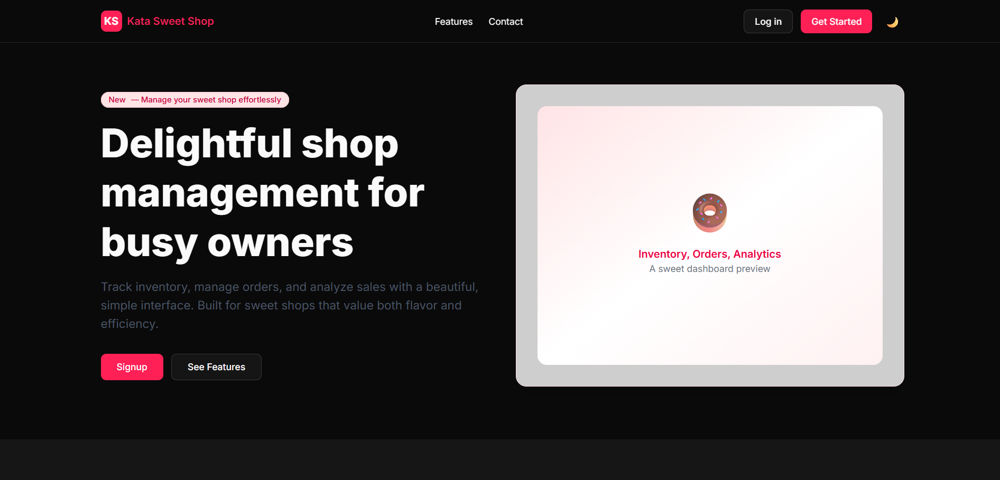
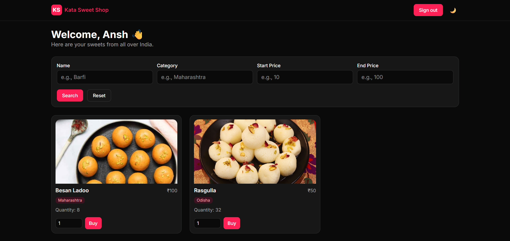
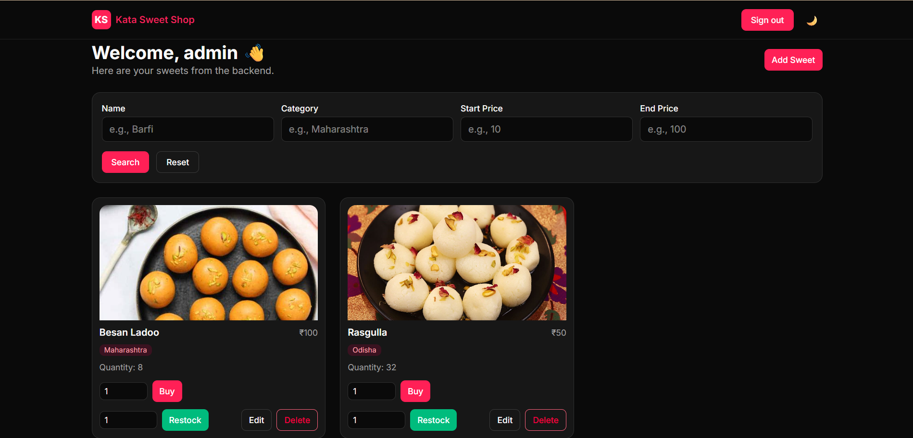

# Kata Sweet Shop 

A modern full‑stack application for managing a sweet shop. It provides inventory tracking, purchasing, restocking, admin CRUD, and helpful search/filters — wrapped in a clean, responsive UI with GSAP animations.

## Features
- Inventory management: view stock, purchase items, restock, admin add/edit/delete
- Search & filters: name, category, price range
- Auth: sign‑in/sign‑up and role‑based admin actions
- Modern UI: Tailwind styling, reusable components, GSAP-powered animations
- REST API: sweets, auth, and related operations

## Tech Stack
- Frontend: React + TypeScript (Vite), TailwindCSS, GSAP (@gsap/react, ScrollTrigger)
- Backend: Node.js + Express + TypeScript
- Database/ORM: Prisma + PostgreSQL (hosted on Render)


---

## Local Development – Setup & Run

### Prerequisites
- Node.js 18+
- PostgreSQL (Production: Render Postgres.)

### 1) Backend Setup
Path: `backend/`

1) Create `backend/.env`:

```env
DATABASE_URL="postgresql://<user>:<password>@<host>:<port>/<db>?sslmode=require"
JWT_SECRET="a-strong-secret"
PORT=5000
```

- For Render Postgres, copy the External Connection URL from the Render dashboard and paste it into `DATABASE_URL`.

2) Install dependencies:

```bash
cd backend
npm install
```

3) Generate Prisma client and run migrations:

```bash
npx prisma generate
npx prisma migrate dev --name init
```

4) Build and start the server:

```bash
npm run build
npm start
```

The API should be available at `http://localhost:5000` (or your chosen PORT).

### 2) Frontend Setup
Path: `frontend/`

1) Create `frontend/.env`:

```env
VITE_API_URL=http://localhost:5000
```

2) Install dependencies:

```bash
cd frontend
npm install
```

3) Start the dev server:

```bash
npm run dev
```

Vite will print a local URL (for example, `http://localhost:5173`).

### 3) Using the App
- Visit the frontend URL.
- Sign up or sign in.
- Admins can Add/Edit/Restock/Delete sweets. Regular users can browse and purchase.


---

## Screenshots
Add images to `frontend/public/screenshots/` (or use remote image URLs) and reference them here.

- Home (Hero)
  
- Dashboard (User)
  
- Dashboard (Admin)
  


---

## Project Structure (high level)
```
kata-shop-management-system/
├─ backend/
│  ├─ src/
│  │  ├─ index.ts
│  │  ├─ routes/
│  │  │  └─ sweetRoutes.ts
│  │  ├─ middleware/
│  │  └─ prisma.ts
│  ├─ prisma/
│  │  ├─ schema.prisma
│  │  └─ migrations/
│  └─ .env
├─ frontend/
│  ├─ src/
│  │  ├─ components/
│  │  │  ├─ Hero.tsx
│  │  │  ├─ Features.tsx
│  │  │  ├─ SweetsDashboard.tsx
│  │  │  └─ sweets/* (cards, modals, types, filters)
│  │  ├─ context/AuthContext.tsx
│  │  └─ main.tsx
│  ├─ public/
│  │  └─ screenshots/
│  └─ .env
└─ Readme.md
```

---

## API (quick peek)
- `POST /api/auth/signup` – Sign up
- `POST /api/auth/signin` – Sign in
- `GET /api/sweets` – List sweets
- `GET /api/sweets/search?name=&category=&startPrice=&endPrice=` – Filtered search
- `POST /api/sweets/purchase` – Purchase (auth required)
- `PUT /api/sweets/:id` – Update a sweet (admin)
- `DELETE /api/sweets/:id` – Delete a sweet (admin)
- `POST /api/sweets` – Create a sweet (admin)

See `backend/src/routes/sweetRoutes.ts` for validations and details.

---

## My AI Usage
- Which AI tools I used
  - GitHub Copilot (for editor auto‑completion and inline suggestions)
  - ChatGPT (Cascade) for refactoring guidance, and pair‑programming
  - ChatGPT for general R&D, debugging

- How I used them
  - I used Windsurf's ChatGPT for auto-completion.
  - I used Windsurf's ChatGPT to design and refactor parts of `SweetsDashboard.tsx`.
  - I asked ChatGPT to implement search via a reusable helper in `SweetsFilters.tsx` and import it into the dashboard component.
  - I relied on Copilot for a small amount of time for auto‑completion and smaller code snippets.
  - I used ChatGPT to debug problems related to hosting both database and backend on render.

- Reflection on AI’s impact
  - AI sped up repetitive coding (fetch calls, handlers, state updates) and suggested consistent patterns just like me (eg, using safeParse function of zode with same status error code, clearer error handling).
  - It improved my velocity for UI/UX tweaks and animations by providing production‑ready snippets I could use.
  - My input was still essential: I reviewed diffs, corrected occasional brace/scope issues which I thought could be solved faster by AI.
